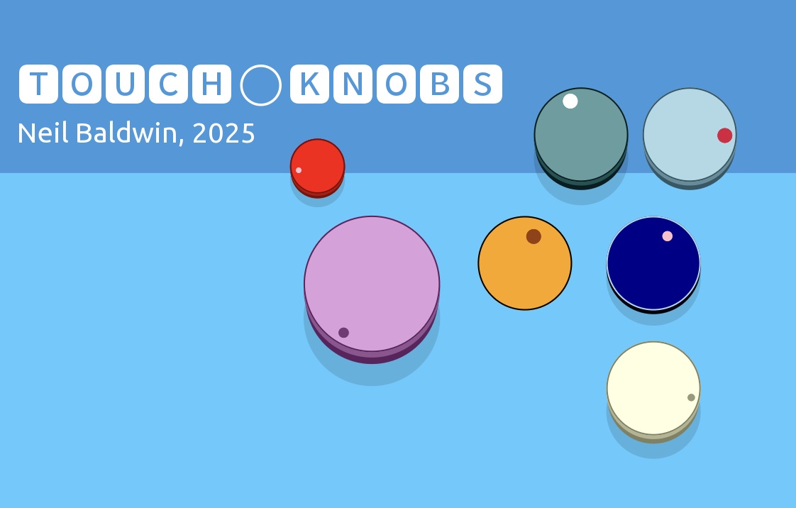

# TOUCH-KNOBS
Custom modular-style knobs for Touch OSC

## What is TOUCH-KNOBS?

Born partly out of the desire to have a knob-type object that was simultaneously simpler and more customizable than the stock Radial or Encoder Touch OSC objects, and partly because I got a tiny-bit obsessed with inventing a way to customise objects at run-time.

TOUCH-KNOBS uses a simple and readable parameter string placed in the Tag parameter of the Knob object (actually a group of related components that fit together to make the Knob) that allows you to customise the Knob. You can customise:

* knob color
* pointer color
* pointer size
* pointer offset (from edge of knob)
* three 'styles': "flat", "short" and "tall" (the last two have a pseudo 3D effect)
* knob outline (on/off and color)
* rotation angle range
* drop shadow on/off

In addition, the geometry of the Knob (and it's sub-components) is all re-calculated at run-time based on the dimensions of the Knob object (Group). You *turn* the Knob by touch-dragging up and down rather than the rotational gesture required by the Radial and Encoder objects.

## How do I use it?

Download the TOUCH-KNOBS.tosc file and open it in Touch OSC. You will see a bunch of TOUCH-KNOBS to play with. We'll get to the customisation and options but first you need to know the fundamentals.

### TOUCH-KNOB Components

There are two *components* to TOUCH-KNOBS:

#### Root Lua Script

This script does 95% of the work. It's mainly concerned with parsing the Knob parameters and setting up the geometry, colors and options. It also contains a table of CSS Color Names as when specifying colors in your Knob you can use either the CSS name or a hex string in the format `0xRRGGBB`

If you want to use TOUCH-KNOBS in your project, this Lua script need to go in the document root of your Touch OSC file.

#### "Knob" Objects

Knob objects are actually Group objects containing the various components that make up the Knob geometry: BODY, POINTER, SHADOW1, SHADOW2, OUTLINE, FADER and DROP_SHADOW (more on these later).

The creation/customisation parameters go in the Tag parameter of the Knob (Group).

To make a new Knob just copy-and-paste and existing one then change it's parameters in the Tag.

> [!NOTE]
> To make a Knob of a different size, hold SHIFT and resize the Knob group. The resized Knob won't display correctly until you exit Edit mode in Touch OSC as the Knob geometry is calculated at run-time based on the size of the Knob group.

## Customisation

You can set various parameters to customise the colours, geometry and various other options of the TOUCH-KNOB.

The way you do this is to create a parameter string the the Knob object's Tag parameter.

The parameters take the form of `parameter=value`. You can specify multiple parameters by separating them with a comma e.g.: `parameter1=value,parameter2=value`

The parameters can be placed in any order. You can specify as many or as few (none, even!) parameters as you like. Where you don't specify a parameter, sensible defaults will be chosen at run-time.

### Parameters

#### `knob`
Sets the colour of the Knob body (the main part of the Knob). Defaults to a mid-gray colour if not specifed.

e.g `knob=red` or `knob=0x808080`

#### `pointer`
Sets the colour of the Knob pointer/position indicator. Defaults to either a ligher or darker version of the body color depnding on the perceived luminance of the body color.

e.g. `pointer=yellow`

#### `pointer_size`
Sets the size of the Knob pointer. This is a normalised value (0.0 to 1.0) and is relative to the size of the Knob body.

e.g. `pointer_size=0.25`

#### `pointer_offset`
Sets the distance of the pointer from the circuference of the knob body. This is a normalised value and is relative to the radius of the knob body.

e.g. `pointer_offset=0.2`

#### `angle`
Set the range of rotation for the knob pointer and is an integer number between 90 and 330. Default is 270. The angle doesn't affect the range of output from the knob which is always 0.0 to 0.1

e.g. `angle=300`

#### `style`
Sets the *style* of the Knob. This is just a visual embelishment to give the impression of a pseudo-3D knob (if required). There are three options: `flat`, `short` and `tall`. Default is `flat`.

e.g. `style=tall`

#### `shadow`
Turns a drop-shadow effect on or off. Options are `true` or `false`. Default is `false`

e.g. `shadow=true`

#### `outline`
Adds a colored outline to the knob body. Options are `true` or `false`. Default is `false`

e.g. `outline=false`

#### `outline_color`
Sets the color of the body outline. If this parameter is not specified the outline colour is a darker version of the body color.

e.g. `outline_color=white` or `outline_color=0xFF0000`

